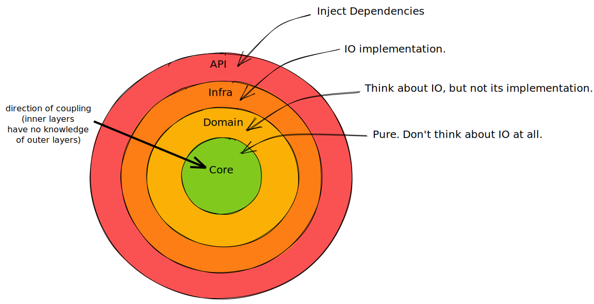

# Onion Architecture

## Source code for the simplest example

Similar to [Hexagonal Architecture][hexagonal-architecture] (also known as "Ports and Adapters") and [Uncle Bob's Clean Architecture][clean-architecture], the [Onion Architecture][onion-architecture] advocates a structure for our application that allows us to segregate core business logic.

Imagine the concentric layers of an onion where you can only call inwards (i.e. from an outer layer to an inner layer). Let's see how this might work by starting at its core.

I've augmented each layer's description with a simple code example. I've used [Rust][rust] for this, because it's awesome! [Fight me][rust-post]. Even if you don't know Rust, it should be easy to understand this example, but I've added a commentary that may help, just in case. The source code is [here](./src/main.rs).



The _core_ is pure in the functional sense, i.e. it has no side-effects. This is where our business logic resides. Notice how easy it is to test because its pure functions only take and return values. In our example, our _core_ is just a single function that takes 2 integers and adds them together. In the _core_, we don't think about IO at all.

```rust
/// 1. Pure. Don't think about IO at all
mod core {
    pub fn add(x: i32, y: i32) -> i32 {
        x + y
    }

    #[cfg(test)]
    mod tests {
        #[test]
        fn adds() {
            let actual = super::add(1, 2);
            let expected = 3;
            assert_eq!(actual, expected);
        }
    }
}
```

Surrounding the _core_ is the _domain_, where we do think about IO, but not its implementation. This layer orchestrates our logic, providing hooks to the outside world, whilst having no knowledge of that world (databases etc.).

In our code example, we have to use an asynchronous function. Calling out to a database (or something else, we actually don't care yet) will take some milliseconds, so it's not something we want to stop for. The `async` keyword tells the compiler to return a `Future` which may complete at some point. The `Result` is implicitly wrapped in this `Future`.

Importantly, our function takes another function as an argument. It's this latter function that will actually do the work of going to the database, so it will also need to return a `Future` and we will need to `await` for it to be completed. Incidentally, the question mark after the `await` allows the function to exit early with an error if something went wrong.

```rust
/// 2. think about IO but not its implementation
mod domain {
    use super::core;
    use anyhow::Result;
    use std::future::Future;

    pub async fn add<F, Fut>(get_x: F, y: i32) -> Result<i32>
    where
        F: Fn() -> Fut,
        Fut: Future<Output = Result<i32>>,
    {
        let x = get_x().await?;

        let result = core::add(x, y);

        Ok(result)
    }
}
```

Those 2 inner layers are where all our application logic resides. Ideally we wouldn't write any other code. However, in real life, we have to talk to databases, an event bus, or another service, for example. So the outer 2 layers of the onion are, sadly, necessary.

The _infra_ layer is where our IO code goes. This is the code that knows how to do things like calling a database.

```rust
/// 3. IO implementation
mod infra {
    use anyhow::Result;

    pub async fn get_x() -> Result<i32> {
        // call DB, which returns 7, then..
        Ok(7)
    }
}
```

And, finally, the _api_ layer is where we interact with our users. We present an API and wire up dependencies (in this example, by passing our _infra_ function into our _domain_ function):

```rust
/// 4. inject dependencies
mod api {
    use super::{domain, infra};
    use anyhow::Result;

    pub async fn add(y: i32) -> Result<i32> {
        let result = domain::add(infra::get_x, y).await?;

        Ok(result)
    }
}
```

We'll need an entry-point for our service:

```rust
#[async_std::main]
async fn main() {
    let result = api::add(3).await;
    println!("When we add 3 to the DB value (7), we get {result:?}");
}
```

Then, when we run it we see it works!

```bash
cargo run
    Finished dev [unoptimized + debuginfo] target(s) in 0.06s
     Running `target/debug/onion`
When we add 3 to the DB value (7), we get Ok(10)
```

[clean-architecture]: https://blog.cleancoder.com/uncle-bob/2012/08/13/the-clean-architecture.html
[hexagonal-architecture]: https://en.wikipedia.org/wiki/Hexagonal_architecture_(software)
[onion-architecture]: https://jeffreypalermo.com/2008/07/the-onion-architecture-part-1/
[rust-post]: https://blog.red-badger.com/now-is-a-really-good-time-to-make-friends-with-rust
[rust]: https://www.rust-lang.org/
